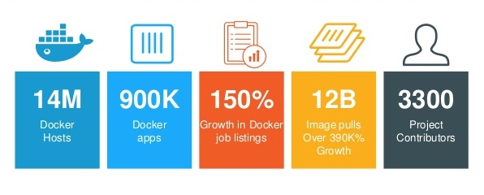
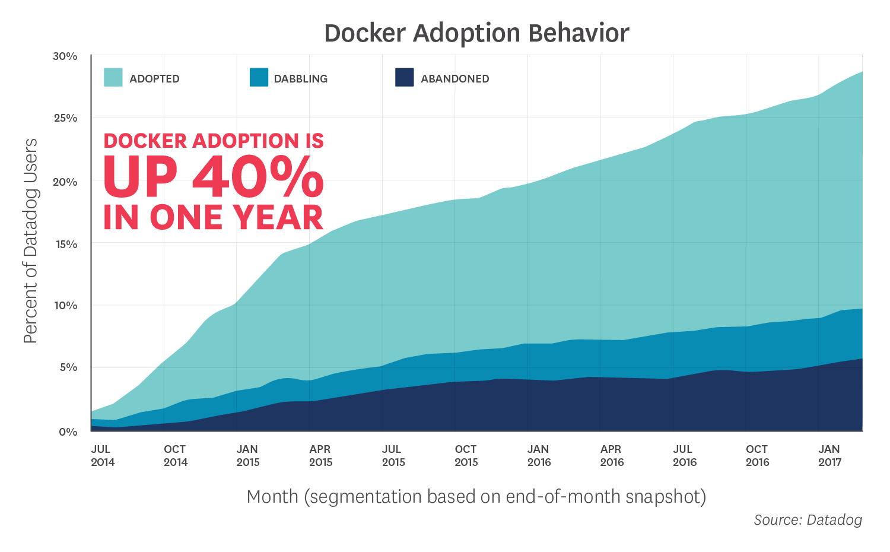

# 1. Building a container image

This chapter depicts important information about building your first WSO2 container image.

### Contents

The following will be discussed in detail in the document.

* [1.1. Why should you choose Docker as your container runtime ?](#Why-docker)
* [1.2. Using WSO2 images](#using-wso2-images)
* [1.3. Building from source](#building-from-source)
* [1.4. Tips to harden your image](#tips-to-harden-your-image)
* [1.5. Tips on Tagging](#tips-on-tagging)
* [1.6. Vulnerability scanning and container security check](#scanning)
* [1.7. Image signing and Verification](#signing)

<br/>

## 1.1. Why should you choose Docker as your container runtime ?

Started just 7 years ago in 2013, Docker introduced what would become the industry standard for containers and is undeniably yet the defacto standard to build, share and run containerized apps. 



Among many factors which led WSO2 to choose and recommend Docker as its first choice for a container runtime, following are key.

* Docker’s ability to manage a complete container lifecycle.
* Less learning curve and advanced feature set.
* Wide community support towards its development and maintenance.
* High popularity and customer demand.

<br/>



## 1.2. Using WSO2 images

WSO2-curated product Docker images are available for usage from both :

[1] [Docker Hub](https://hub.docker.com/u/wso2/) : <br/>
* Contains images built with the inclusion of GA released product packs and is publicly available for use free of charge.

[2] [WSO2 Private Docker Registry, docker.wso2.com](https://docker.wso2.com/) : <br/>
* Contains Docker images built with the inclusion of regularly updated product packs and is accessible only for its subscribed customers. 

WSO2 recommends using these images in containerized deployments of WSO2 products. This is mainly because WSO2 has aligned its Docker images with its recommended best practices for product deployments.

Following are some of the key features of WSO2 product Docker images, which aligns them with WSO2-recommended best practices for container based product deployments:

* *WSO2 recommends applying changes to the default configurations of a WSO2 product running inside a container via a volume mount. Our Docker images support this feature via a dedicated volume mount by the name:* ```wso2-config-volume``` <br/> (Refer to [this article](https://medium.com/faun/wso2-products-dockerized-advanced-usage-part-1-ae255ef02661) for more details)

* *WSO2 recommends introducing additional artifacts / non-configuration files (e.g. third-party libraries, Carbon extensions in the form <br/> of OSGi bundles, Carbon Applications or any security-related artifacts such as Java Keystore files) to a WSO2 product <br/>running inside a container via a volume mount. Our Docker images support this feature via a dedicated volume <br/>mount by the name:* ```wso2-artifact-volume``` (Refer to [this article](https://medium.com/faun/wso2-products-dockerized-advanced-usage-part-2-9c851b0db557) for more details)

* *WSO2 recommends introducing patches (or hotfixes) to a WSO2 product running inside a container via a volume mount. <br/>Our Docker images support this feature via a dedicated volume mount by the name:* ```wso2-patch-volume``` <br/>(Refer to [this article](https://medium.com/faun/wso2-products-dockerized-advanced-usage-part-2-9c851b0db557) for more details)

* *Supports passing WSO2 product startup options.*
(Refer to [this article](https://medium.com/faun/wso2-products-dockerized-remote-debug-dockerized-wso2-products-with-intellij-idea-111ca8ae60c) as an example for more details)

WSO2 has followed an array of [best practices](https://docs.docker.com/develop/develop-images/dockerfile_best-practices/) and [guidelines](https://github.com/docker-library/official-images#review-guidelines) recommended by the Docker community during the implementation of its product Docker resources.

Some of the best practices and guidelines that are followed for Dockerfiles and entry point scripts are explained below. 

* *Minimized container image size:*

    + *Minimizing the number instructions in the Dockerfile that would create sizeable image layers,  leading to reduced image size.* <br/> (Refer to [this section](https://docs.docker.com/develop/develop-images/dockerfile_best-practices/#minimize-the-number-of-layers) for advanced details)

    + *The product distribution pack and its dependencies are removed to prevent the Docker image size from increasing. <br/> Only the necessary software packages have been installed.* (Refer to [this section](https://docs.docker.com/develop/develop-images/dockerfile_best-practices/#dont-install-unnecessary-packages) for more details)

* *Non-root user:* 

    + *WSO2-released Docker images ship with ‘wso2carbon’ non-root user for running WSO2 products.*

* *Heightened Clarity:* 

    + *Due to sorted multi-line arguments.* (Refer to [this section](https://docs.docker.com/develop/develop-images/dockerfile_best-practices/#sort-multi-line-arguments) for more details)

In case of an extension, WSO2 recommends using an official WSO2 product Docker image as the base of that extended Docker image. 

<br/>

## 1.3. Building from source

In case if the preference is to build the images from source, since this gives you greater control over the image and the conditions <br/>affecting its security, WSO2 recommends referring to the official GitHub release of the Docker resources of the relevant <br/>WSO2 product to write your Dockerfile and build a WSO2 product Docker image by source.

Also in case if your preferred JDK is different from the default that we pack, you can follow this approach to build your own Docker image.

Useful reference points:

[1] [Docker resources for WSO2 API Management](https://github.com/wso2/docker-apim) <br/>
[2] [Docker resources for WSO2 Integration](https://github.com/wso2/docker-ei) <br/>
[3] [Docker resources for WSO2 Identity and Access Management](https://github.com/wso2/docker-is) <br/>
[4] [Docker resources for WSO2 Open Banking](https://github.com/wso2/docker-open-banking)

<br/>

## 1.4. Tips to harden your image

Key takeaways from our experience to write your Dockerfile :

```
[1] Verify Authenticity of any software installed in the image
[2] Always use HTTPS for files added remotely
[3] From directive: Use specific / unique tag
[4] Never run as root
[5] USER directive: Always
[6] Drop privileges where necessary
[7] Expose only required ports
```

Useful reference points:

[1] [Docker resources for WSO2 API Management](https://github.com/wso2/docker-apim) <br/>
[2] [Docker resources for WSO2 Integration](https://github.com/wso2/docker-ei) <br/>
[3] [Docker resources for WSO2 Identity and Access Management](https://github.com/wso2/docker-is) <br/>
[4] [Docker resources for WSO2 Open Banking](https://github.com/wso2/docker-open-banking)

<br/>

## 1.5. Tips on Tagging

WSO2 product docker image tagging strategy is simple.

[1] Per each product version, we maintain an image queue. <br/>
This queue can hold a maximum of 3 images from the oldest to the latest and each bear a unique tag to distinguish itself from the other.

* *E.g.* 	
        <br/>
        *wso2am:3.1.0.1591023165861.2 - Oldest* <br/>
        *wso2am:3.1.0.1591230650206.3 - 2nd oldest* <br/>
	    *wso2am:3.1.0.1592240780334.4 - latest* <br/>

        Unique tag: <product>:<version>.<wso2-update-timestamp>.<docker-tag-last-digit>

This queue is regularly updated with a new image having an update (or in other words, a patch) either to the product or Docker artifacts. When a new image is pushed, the oldest of the 3 is removed from the registry on a first-in-first-out (FIFO) basis. 

Unique tags are ideal in referring to an image during deployments and we recommend customers to use this tag when they directly use WSO2 images for their deployments without any customizations.

[2] We also maintain one stable tag per each product version. <br/>
A stable tag is always pointed to the latest Docker image of a particular product version. 

Taking the same example from [1], 

* *E.g.* 	
        <br/>
        *wso2am:3.1.0.1591023165861.2 - Oldest* <br/>
        *wso2am:3.1.0.1591230650206.3 - 2nd oldest* <br/>
	    *wso2am:3.1.0.1592240780334.4 (unique), wso2am:3.1.0 (Stable) - latest* <br/>

        Stable tag: <product>:<version>

Stable tags are ideal in referring to a base image during Docker build. We recommend customers to use this tag when they want to build their custom images on top of the product Docker images that we host.

[3] We maintain a latest tag per each product. <br/>
The latest tag is also a stable tag and is always pointed to the latest Docker image of a product repo.

Taking the same example from [2], if 3.1.0 is the latest version of wso2am,

* *E.g.* 	
        <br/>
        *wso2am:3.1.0.1591023165861.2 - Oldest* <br/>
        *wso2am:3.1.0.1591230650206.3 - 2nd oldest* <br/>
	    *wso2am:3.1.0.1592240780334.4 (unique), wso2am:3.1.0 (Stable), wso2am:latest (stable) - latest*

        Latest tag: <product>:latest

WSO2 recommends a similar tagging mechanism to its customers.

Key takeaways:

[1] Uniquely identifying an image is key. <br/>
[2] Use unique tags for images used directly in your deployments. <br/>
[3] A stable tag is recommended only for an image used as a base for your deployed image. 

<br/>

## 1.6. Vulnerability scanning and container security check

If a container image includes a vulnerability, then every container generated using the image will also include that vulnerability. Hence it is really important that you scan the newly built image for any vulnerabilities prior to the promotion of the image into a registry.  

Among many other alternative scanning tools, WSO2 uses and would also like to recommend [Clair](https://coreos.com/clair/docs/latest) for this purpose. Clair is an open source project for the static analysis of vulnerabilities in Docker containers. Clair scans each container layer and provides a notification of vulnerabilities that may be a threat, based on the Common Vulnerabilities and Exposures database (CVE) and similar databases from Red Hat, Ubuntu, and Debian.

Additionally, the Center for Internet Security (CIS) has a [Docker Benchmark](https://www.cisecurity.org/benchmark/docker) for evaluating the security of a Docker container.

Docker provides an open source script called [Docker Bench for Security](https://github.com/docker/docker-bench-security). You can use this script to validate a running Docker container against the CIS Docker Benchmark. It can help you verify many items in the CIS Docker Benchmark, but not all items are verifiable with the script. For example, the script cannot verify if the host for the container is hardened or if the container image includes personal data. Review all items in the benchmark and identify those that might need additional verification.

<br/>

## 1.7. Image signing and Verification

Whether you are using a private image registry in-house or a public registry such as Docker Hub, it's important to know that you are running only the code that you actually intend to run. The potential for malicious code or man-in-the-middle attacks on downloads is an important factor in protecting your container images.

As such, Docker supports the ability to sign images and verify that the contents have not changed. Publishers can use keys to sign the images when they are pushed to the registries and users can verify the signature on the client-side when downloading them for use.
